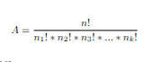

# Anagram Strategy

## What is an Anagram?
An Anagram by definition is a word of the same length composed of the same letters arranged in a different order.
Essentially an anagram is a combination of all characters in the string, excluding duplicates.

Mathematically the number of possible Anagrams (A), can be represented as:

Where,\
\
**n is the length of the string**\
**! represents a factorial**
**** 
There are many ways to skin a cat. However, I came up with what I feel is the most optimal solution.

## My Strategy
We are going to create an index, which will be a Map structure with the key representing the alphabetically 
sorted string and the value representing a set of all the anagrams of said string.

### Building the index...

**Algorithmic Complexity: O(n)**

At the beginning of our execution, we build out an index making a upfront significant investment,
what we get back in return is fast retrieval for searching.

**Memory Complexity: O(n)**\
Although in theory they are the same memory complexity, this strategy consumes more
physical memory in comparison with just a simple list structure.

1. Key-Value Pairs & References:  A map stores unique keys along with pointers to the values (the sets).
2. Set Overhead: Internally, sets use additional wrapper objects to prevent
duplicates and maintain balancing or hashing structures.
3. Load Factor & Capacity Padding: Because of the nature of hashing we require a larger underlying array 
than the number of items stored to keep lookups fast, leaving empty, allocated slots
4. Pointer Chasing & Memory Fragmentation: Because elements in maps/sets are often scattered in memory rather than contiguous, 
you suffer from the memory footprint, this also puts additional string on the garbage collector for cleanup. 

Suffice to say,
we sacrifice memory space for faster searching, in other methods we could simply store strings in a Set,
here we are using a Map of Set. 

As a result, we are using significantly more memory comparatively, but considering that memory is cheap, we 
are willing to make this tradeoff. 

Pseudocode
 for each word in textfile:
    key = sortedAlphabetically(word)
    if (key in map does not exist):
       insert the key, create a set with the first element of word;
    else // key,value pair already exists
       get the set by reference using key and insert value;

### Searching...

#### Algorithmic Complexity: O(1)
Because of our upfront cost, the payoff is incredibly fast searching.

Pseudocode
key = sortedAlphabetically(word)
return map.get(key)

#### Memory Complexity: O(1)
Our structure is built, the word length is of no significance here, simply sort it
to a unique key and perform a search to get our value.

## Why my strategy?

The idea is simple, if we have a system it is preferable to do the time-consuming
work at the beginning, 

this way we get a better performance when running our application for searching.

